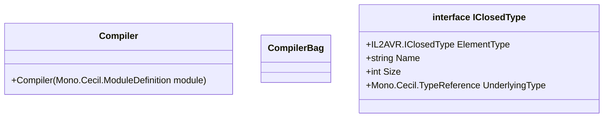

```mermaid
classDiagram
    class Compiler {
        +Compiler(Mono.Cecil.ModuleDefinition module)
    }

    class CompilerBag {
        
    }
    
    class IClosedType["interface IClosedType"] {
        +IL2AVR.IClosedType ElementType
        +string Name
        +int Size
        +Mono.Cecil.TypeReference UnderlyingType
    }


```
