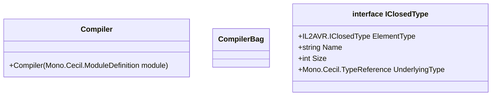

# Class diagrams:

```mermaid
classDiagram
    class Compiler {
        +Compiler(Mono.Cecil.ModuleDefinition module)
    }

    class CompilerBag {
        
    }
    
    class IClosedType["interface IClosedType"] {
        +IL2AVR.IClosedType ElementType
        +string Name
        +int Size
        +Mono.Cecil.TypeReference UnderlyingType
    }
```

# State machines:
```mermaid
stateDiagram-v2
    [*] --> CompileTimeMethodEvaluator
    CompileTimeMethodEvaluator --> Run
    
    state Step() {

    }
```